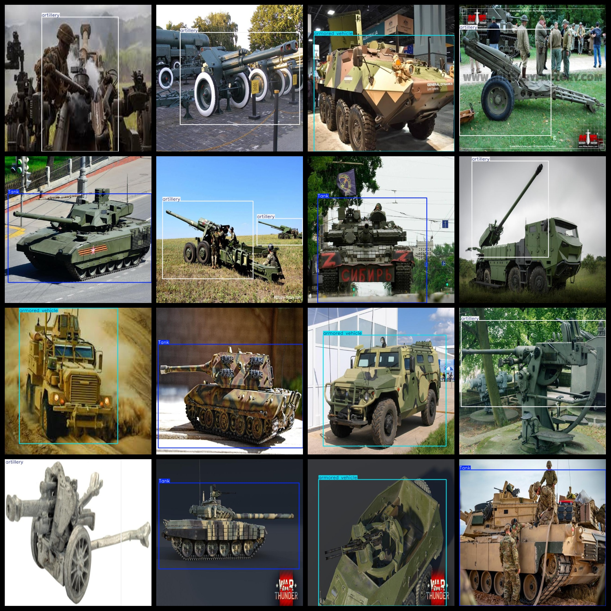
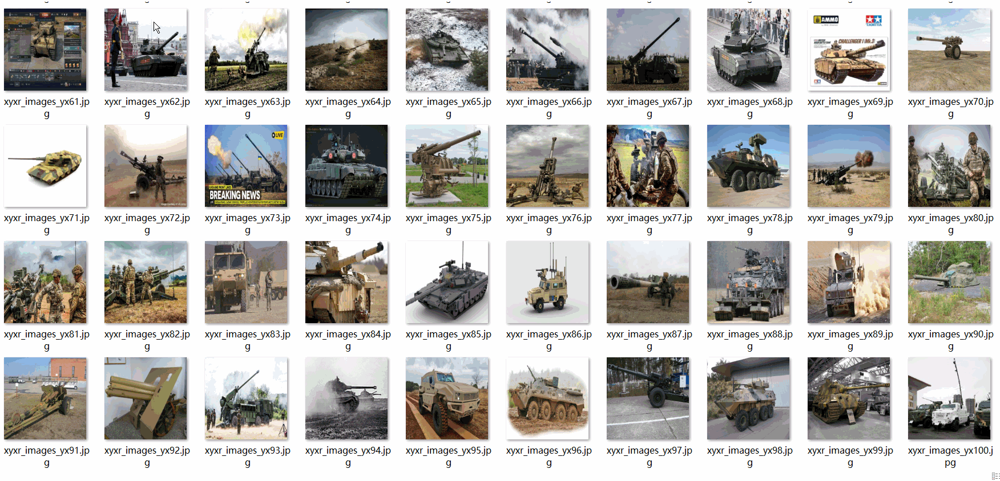

# Military Target Ground Heavy Weapon Dataset 3-class4662 imagesVOC+YOLO format

This dataset is a collection of 3 categories and 4662 ground heavy weapon images in the VOC+YOLO format.

Dataset format: Pascal VOC format + YOLO format (the txt file does not contain the split path, it only contains jpg images and corresponding VOC format xml files and yolo format txt files)

Number of images (number of jpg files): 4662

Number of annotations (number of xml files): 4662

Number of txt files: 4662

Number of annotated categories: 3

The Github repository is: datasets_sl

["Tank", "armored vehicle", "artillery"]

Number of boxes labeled in each category:

Tank Frames = 1662

Armored vehicle Frames = 1973 (Armored vehicle)

Artillery Frames = 1505 (artillery)

Total frames: 5140

Number of images per category:

Tank owns 1513 images.

Armored vehicle ownership count = 1851

Artillery occupancy image count = 1328

Image resolution: 640x640

Use the labeling tool: labelImg

Dataset Augmentation: No

Rules for annotation: Draw a rectangle around the category.

Important note: The dataset does not have been divided into training, validation, and testing sets.

Special Disclaimer: This dataset does not guarantee the accuracy of the trained models or weight files.

Annotation and image details are as follows:

## Images

---

Here is a pay link on Stripe (https://buy.stripe.com/3cs8yP7sY87d0vu9AB). Please contact me lonlonago@foxmail.com after funding $89, and I will send you a complete data files, thank you!

